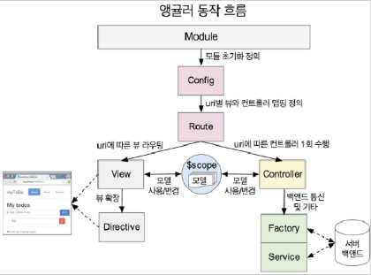
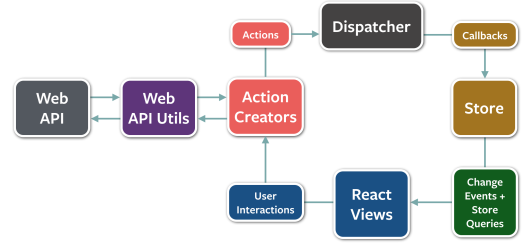

# angular vs react

## angular 

1. mvc pattern 기반의 2way binding
 - scope를 이용하여 양방향으로 데이터 model과 view간의 데이터를 동기화 함.
 - 이때, scope에서 데이터 변경 시 digest loop가 자동으로 발생하여 controller와 view를 동기화해준다.
 - 장점 : framework에서 자동으로 동기화 처리를하므로 작성될 코드의 양이 줄어든다.
 - 단점 : 
 
 1) 데이터 변경 시 digest loop가 발생되므로 메모리 사용량이 커진다.
 
 2) model과 view 간에 연결관계가 복잡해 질 수록 scope 추척이 어려워진다.
 
 3) 때문에 코딩 전 model/view 간의 데이터 흐름도 및 메모리 상의 적절한 scope를 위한 설계가 필수로 진행되어야 한다.  

2. directive를 통해 DOM을 처리한다.
 - 사전에 정의 되어 있는 또는 사용자가 정의한 directive를 통해 DOM를 만들거나 사용함
 - DOM확장성 면에서는 뛰어나지만, scope 변경마다 digest loop가 발생되어 view를 다시 랜더링하는데 적지 않는 시간이 소요됨 

3. grunt / gulp를 이용한 자동화 빌드 제공 + es3(es5)
 
## react 

1. flux pattern 기반의 1way binding 
 - prop / state를 이용하여 단방향으로 model과 view간의 데이터를 동기화 함
 - 이 때, prop은 바뀌지 않는 데이터(boolean type)로 view에 전달하고, state를 이용하여 변경된 데이터를 update함
 - 장점 : 데이터가 변경된 view부분만 부분적으로 처리하므로 메모리 사용량이 적다.
   
2. JSX를 통해 DOM을 처리한다.
 - virtual DOM인 JSX를 통해 DOM을 Component화 하여 만든 후, 이를 조합하여 사용함
 - view 변경 시 DOM의 전후 구조체를 파악하여 변경된 필요한 view만을 반영하므로 빠른 속도로 처리됨

3. grunt / gulp를 이용한 자동화 빌드 제공 + modulization(webpack/browserfy) + es6
 - es6->es5 변환을 위한 babel module를 필수적으로 사용하여야함(es6가 적용된 이후에는 필요가 없을듯...)

## cf)flux
 - http://haruair.github.io/flux/docs/overview.html 참조함
 - dispatcher-store(비즈니스 로직)-view 구조임
 - view에서 데이터 변경 시 dispatcher를 통해 action을 전달함
 - 전달된 action은 store를 통해 acction에 영향이 있는 모든 view를 갱신한다.(dispatcher에 등록된 callback을 통해서)

